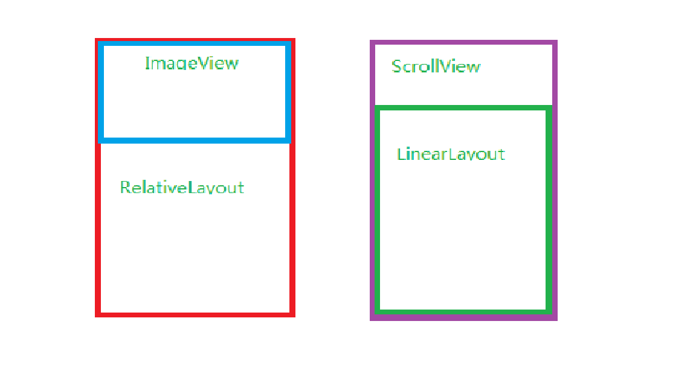
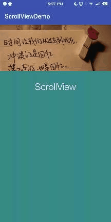

## 重写 onScrollChanged   
```java
    /**
     * ScrollView 滑动时调用该方法
     * @param l 变化后的X轴位置
     * @param t 变化后的Y轴的位置
     * @param oldl 原先的X轴的位置
     * @param oldt 原先的Y轴的位置
     */
    @Override
    protected void onScrollChanged(int l, int t, int oldl, int oldt) {
    
        super.onScrollChanged(l, t, oldl, oldt);
    
        
    }
```
顾名思义，该方法是在产生滑动时调用的，无论是手指拖拽还是惯性产生的滑动，都会调用

在滑动过程中，向上滑动，t值为正
ScrollView还有一个回弹的效果，也就是能向下滑动，再弹回来，此过程t值都是为负的

因为背景拉伸是根据变化的y轴大小来进行拉伸。所以我们只需要t参数

## 设计回调接口

```java
    public void setListener(SvListener svListener) {
        this.mSvListener = svListener;
    }

    public interface SvListener{
        void onChange(float t);
    }
```
然后在onScrollChanged方法中调用
> onChange(t)

这样就可以把变化的t值暴露给主线程

## 在主线程接收回调

```java
 mMyScrollView.setListener(new MyScrollView.SvListener() {
            @Override
            public void onChange(float t) {
                if (-t > 0) {
                    setZoom(-t);
                }
            }
        });
```
在接收到t后做相应的处理，我的背景只有在向下滑动时，所以只有在-l > 0 时才执行拉伸操作

## 根据滑动长度拉伸背景

```java
    /**
     * 拉伸图片
     * @param t 滑动的高度
     */
    private void setZoom(float t) {
        ViewGroup.LayoutParams layoutParams = mIvBackground.getLayoutParams();
        if (first) { //保证获取到原来的长度
            mInitHeight = mIvBackground.getMeasuredHeight();
            mInitWidth = mIvBackground.getMeasuredWidth();
            first = false;
        }
        if (mInitHeight != 0 && mInitWidth != 0 ) {
            layoutParams.height = (int)(mInitHeight + t);
            layoutParams.width = (int)(mInitWidth * ((mInitHeight + t) / mInitHeight));
            mIvBackground.setLayoutParams(layoutParams);
        }
    }
```

## XML结构
```xml
<?xml version="1.0" encoding="utf-8"?>
<RelativeLayout xmlns:android="http://schemas.android.com/apk/res/android"
    xmlns:tools="http://schemas.android.com/tools"
    android:layout_width="match_parent"
    android:layout_height="match_parent"
    tools:context=".MainActivity">

    <ImageView
        android:id="@+id/iv_bg"
        android:layout_width="match_parent"
        android:layout_height="200dp"
        android:background="@color/colorPrimary"
        android:src="@drawable/iv_bg"
        android:scaleType="centerCrop"
        />

    <com.rastargame.rick.scrollviewdemo.MyScrollView
        android:layout_width="match_parent"
        android:layout_height="match_parent"
        android:id="@+id/sv_test"
        >
        <LinearLayout
            android:layout_width="match_parent"
            android:layout_height="match_parent"
            android:orientation="vertical"
            android:layout_marginTop="150dp"
            android:background="#398989"
            android:gravity="center"
            >
            <TextView
                android:layout_marginTop="30dp"
                android:layout_width="wrap_content"
                android:layout_height="match_parent"
                android:text="ScrollView"
                android:textColor="#FFF"
                android:textSize="30dp"
                />
            <View
                android:layout_width="match_parent"
                android:layout_height="800dp">
            </View>


        </LinearLayout>
    </com.rastargame.rick.scrollviewdemo.MyScrollView>
</RelativeLayout>
```